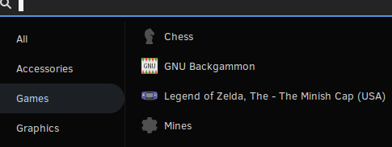

# xdg-retroarch-favourites

Sync [RetroArch](https://www.retroarch.com) favourites directly into your Linux desktop menu system.




## How it works
1. Read from RetroArch (`~/.config/retroarch/content_favorites.lpl`)
2. Enrich from RetroArch playlists (`~/.config/retroarch/playlists/*.lpl`)  
3. Write 
 [XDG desktop entry specification](https://www.freedesktop.org/wiki/Specifications/desktop-entry-spec) for each game to `~/.local/share/applications`
   * Correctly sync create, update and delete actions as appropriate
 
## Requirements
* Python 3.6
* FreeDesktop (XDG) menu specification is supported by most major Linux distros (using Gnome, KDE, Unity etc)

## Install
It's a single script so no "installation" is necessary though you may wish to automatically execute the script each time the favourites are changed.
### systemd
Install a path-trigger into the user services:
```bash
cp xdg-retroarch-favourites ~/.local/bin
cp etc/systemd/* ~/.config/systemd/user
systemctl --user start xdg-retroarch-favourites.path
systemctl --user enable xdg-retroarch-favourites.path
```
### shell
Following shell script is based on `inotify` and can be incorporated into a user login script etc.
```bash
cp xdg-retroarch-favourites ~/.local/bin
cp etc/xdg-retroarch-favourites-service ~/.local/bin
xdg-retroarch-favourites-service
```
